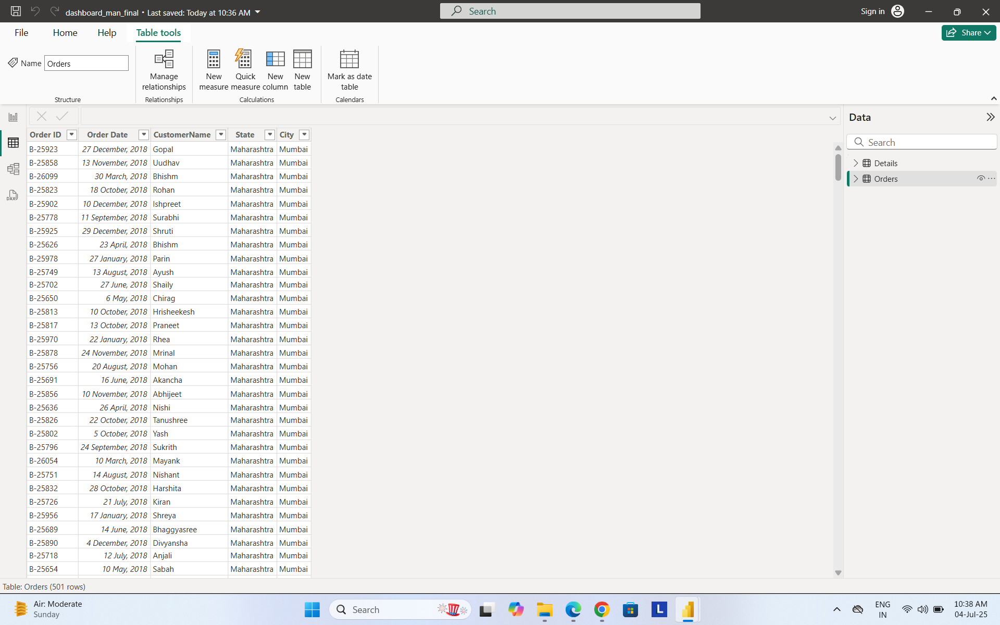

# 🛒 Ecommerce Sales Dashboard - Power BI

This repository (**ecommerce-sales-dashboard-powerbi**) contains an interactive ecommerce sales dashboard built using **Power BI**. The dashboard provides deep insights into sales performance, profit trends, customer behavior, and payment modes.

---

## 📊 Dashboard Overview

The dashboard features:
- **Total Sales Amount** (438K)
- **Total Profit** (37K)
- **Order Volume** (5615)
- **Average Order Value (AOV)** (121K)

---

## 📌 Dashboard Overview

### 🔹 Main Dashboard

- Summary KPIs: Total Sales, Profit, Quantity, Revenue
- Visualizations: Sales by Segment, Profit by Category, Profit by State (Map)
- Dynamic filters and slicers

---

### 🔹 Quarterly View

- Focused analysis on Quarter 1
- All KPIs and visuals dynamically adjust based on time period

---

### 🔹 State Filter Dropdown

- Interactive state dropdown to filter visuals by region
- Supports localized analysis across different states

---

## 🧠 Data Model

- Star schema model with relationships between:
  - Sales
  - Customer
  - Product
  - Date
  - Region

---

## 📊 Table View

- Raw data table
- Columns: Order ID, Product Name, Sales, Quantity, etc.
- Helps in validating and auditing data feeding the visuals

---

### 📈 Key Visuals
- 📉 **Profit by Month** (Bar + Line Combo)
- 🗺️ **Sum of Amount by State**
- 👥 **Sales by Customer Name**
- 🧁 **Quantity by Category** (Donut Chart)
- 💳 **Quantity by Payment Mode**
- 📦 **Profit by Sub-Category** (Horizontal Bar)

---

### 📌 Filters
- 📆 Quarter (Q1 to Q4)
- 🌍 State (Dropdown Filter)

---

## 🛠️ Tools Used
- Power BI Desktop
- DAX (Data Analysis Expressions)
- Data Modeling & Visualization
- SQL Server *(optional backend)*

---

## 🖼️ Dashboard Screenshot

---

## 🙋‍♂️ Author

**My LinkedIn Profile**  
📎 [Connect with me on LinkedIn](https://www.linkedin.com/in/manpreet-kaur-52b805329/)

---

## 📄 License
This project is licensed under the MIT License - see the [LICENSE](LICENSE) file for details.

